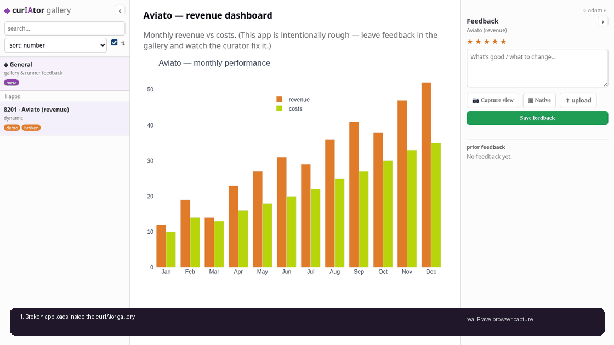

<div align="center">

<h1 align="center">
  <picture>
    <source media="(prefers-color-scheme: dark)" srcset="docs/logo-dark.svg">
    
  </picture>
</h1>

### Your web apps have a curator now.

A self-hosted overlay for your team's web apps — **star, comment, and screenshot** any of them
right in the browser, and an **AI coding agent reads the note, fixes the app, and replies.**
The feedback loop your dashboards never had.

`pip install curiator`

[](https://github.com/LearnedResponse/curiator/actions/workflows/ci.yml)
&nbsp;[](LICENSE)
&nbsp;

[Quickstart](#quickstart) · [How it works](#how-it-works) · [Where the AI runs](#the-agent-and-where-it-runs) · [Why not just…?](#why-not-just-)

</div>

---

<!-- ▶ RECORD THIS: run `curiator demo-up`, follow docs/DEMO_SCRIPT.md, and save the gif to docs/demo.gif (this exact path). -->
[](docs/DEMO_SCRIPT.md)

> *`aviato` loads in the gallery — cramped, no axis labels. You drop a comment + screenshot ("clean up
> the layout"); the curator edits the source, reloads the app, and replies. Refresh — fixed. ~20s, no
> terminal.* &nbsp;·&nbsp; [▶ recording guide](docs/DEMO_SCRIPT.md)

## The problem

You have a pile of internal web apps — Dash dashboards for the sales team, a cohort explorer, three
one-off analyses someone built last quarter. They're scattered across a dozen ports, half of them
are a little broken, and there's **no channel for "hey, this axis is unlabeled"** that doesn't end
in a Slack thread and a context-switch. Feedback dies; the apps rot.

Coding agents can fix this stuff in seconds now — but they're wired to your *editor*, not to the
**live app someone is looking at.** curIAtor wires those two ends together.

## How it works

```
   ┌───────────────────────────────────────────────────────────────┐
   │  one origin · /app/<name>                                     │
   │  ┌────────────┐   ┌──────────────────┐   ┌────────────────┐   │
   │  │  catalog   │   │   the live app   │   │    feedback    │   │
   │  │ (sidebar)  │   │  (in an iframe)  │   │ rate·shot·note │   │
   │  └────────────┘   └──────────────────┘   └───────┬────────┘   │
   └──────────────────────────────────────────────────┼────────────┘
                                                      │ new feedback
                                                      ▼
                                          watcher ──> agent (claude -p / API)
                                                      │ reads note + screenshot + source
                                                      │ edits → smoke-tests → reloads
                                                      ▼
                                                * replies in the panel
```

1. **One gallery, one origin.** Every app mounts at `/app/<name>` behind a single server. (That
   same-origin trick is also what makes the next part possible — you can't screenshot a cross-origin
   iframe.)
2. **Feedback lives in the chrome, not the app.** The ★ / comment / **one-click screenshot + annotation**
   panel wraps *around* each app — so you never touch an app's source to collect feedback on it. It
   lands in a SQLite ledger, which is the single runtime source of truth.
3. **The curator acts.** New feedback wakes an AI coding agent with the comment, the screenshot, and
   the app's source path. It triages, makes the fix (or proposes a plan), smoke-tests it, reloads
   the app, and **replies right in the feedback panel.** You refresh and see it live.

## Quickstart

```bash
pip install curiator
curiator init my-collection --git # scaffold a collection repo (gallery.yaml + apps/ + a sample app)
cd my-collection
curiator app create orange_picker --template dash --title "Orange Picker"
curiator app import https://github.com/me/lab-viewer.git lab_viewer --template react
```

Run `curiator app templates` to inspect the supported Dash, static, Python, Node, Rust, and JS/web
framework scaffolds.

…or point it at existing apps in `gallery.yaml`:

```yaml
apps:
  - name: aviato                       # your app's URL becomes /app/aviato
    mount: { kind: dash-inproc, module: aviato }   # or kind: proxy, cmd/port for anything
    source: ./apps/aviato.py           # what the curator edits
    tags: [sales]

  - name: research_suite                # app directories are first-class
    root: ./apps/research_suite
    source: .                           # the editable source scope for feedback
    mounts:                             # multiple gallery endpoints can share one folder
      - name: dashboard
        mount: { kind: proxy, cmd: "python dashboard.py --port {port}", port: 8701 }
      - name: diagnostics
        mount: { kind: dash-inproc, module: diagnostics, source: diagnostics.py }

agent:
  adapter: headless-cc                 # headless-cc (default) | api | command
  autonomy: auto-small                 # auto-small (fix small things) | propose-only (plan first)

feedback: { dir: ./feedback, screenshots: true }   # SQLite ledger source of truth
```

```bash
curiator up           # serves the gallery at http://127.0.0.1:8300
curiator watch        # arms the feedback→fix loop  (or `curiator serve` to run both at once)
```

Open the gallery, star/comment/screenshot an app, and watch the curator reply. To run it in a
container (one sandbox per collection), see [`docs/USING_CURIATOR.md`](docs/USING_CURIATOR.md).
While an agent is working, curIAtor writes the prompt bundle to `feedback/tasks/<feedback_id>.md`
and streams stdout/stderr to `feedback/replies/<feedback_id>.md`; click a `working`/`done` status
badge to inspect the trace. When you want the receipts, `curiator stats` summarizes the ledger and
git-as-memory commits as human-readable text, JSON, Markdown tables, or CSV rows. Before publishing or
moving a collection, `curiator doctor` flags machine-absolute paths, missing app roots/sources, weak
smoke coverage, missing command/dependency setup, suspicious proxy commands, framework base/root-path
misconfiguration, and likely HMR dev-server proxy commands, then `curiator smoke` runs each app's
configured smoke command. In this checkout, `curiator release-preflight` runs those checks across the
nested public example galleries under `galleries/` and rejects tracked runtime/auth artifacts such as
local user stores, task traces, screenshots, SQLite sidecars, env files, cache files, and installed
dependency directories, plus local editable/path dependency pins in requirements files; add `--fresh-clone` to
verify the committed state survives a same-machine clone, and `--strict` to make doctor warnings fail
publication gates. Add `--include-optional` when checking finance and phylogenetics alongside the
minimum release set.
Screenshot capture details and fidelity tradeoffs are in [`docs/SCREENSHOT_CAPTURE.md`](docs/SCREENSHOT_CAPTURE.md).

Already inside an app repo with Claude Code or Codex? Link it once and use the same loop interactively:

```bash
curiator link --gallery ../my-collection/gallery.yaml --app orange_picker --commands
curiator work <feedback_id>        # prints the exact task bundle for this item
curiator done <feedback_id> "Changed the picker and smoke-tested it"
```

The Claude `/curiator` command and Codex `$curiator` skill installed by `--commands` are thin:
they call the CLI, which writes the same ledger, task bundle, reply trace, reload, and
git-as-memory commit as the headless watcher.

## The agent, and where it runs

curIAtor is **bring-your-own-agent** — it's the harness that wires live-app feedback to whatever
coding agent you already have. Pick the adapter that fits your setup:

| adapter | billing | project context | scales to a team? | best for |
|---|---|---|---|---|
| **`headless-cc`** *(default)* | your Claude subscription | full — loads `CLAUDE.md` + memories + skills | no (one machine) | **solo / small, self-hosted** |
| **`api`** | per-token (Anthropic API / Agent SDK) | inject a `CONTEXT.md` / knowledge store | **yes** | **shared teams / hosted** |
| **`command`** | whatever you wire | yours | depends | aider / Codex / a script |

> **Model- and provider-agnostic.** curIAtor is the harness, not the brain — you bring the agent CLI,
> and it holds the model/provider choice. Run Claude Code on Anthropic, Bedrock, Vertex, or an
> Anthropic-compatible gateway; or `command`-adapter into Codex / aider / any CLI pointed at
> OpenAI-compatible or local models (Ollama, vLLM, LM Studio, LiteLLM). Nothing in curIAtor to change.

…and the **autonomy dial** decides how much it does on its own:

- **`auto-small`** — auto-applies clearly-scoped low-risk fixes (after a smoke-test); proposes a plan
  for anything substantive. Great on your own box.
- **`propose-only`** — never edits unprompted; every change is a plan you approve (and, on the `api`
  adapter, a PR you review). The right default for a shared team.

Security note: feedback is prompt input to an agent with whatever edit/run permissions you grant it.
For shared or public deployments, use authentication, `propose-only`, least-privilege credentials, and
one container/VM per collection. See [SECURITY.md](SECURITY.md).

> **Teams:** pair the `api` adapter with a project knowledge store (e.g. [Graphify](https://github.com/shamsi/graphify))
> so the cold agent fixes with *fresh* repo context instead of a stale snapshot. curIAtor collects the
> feedback and runs the loop; the knowledge store supplies the context. They compose; they don't overlap.

## Why not just…?

- **…Streamlit Cloud / HF Spaces / Posit Connect / Retool?** Those are galleries — they host and
  share apps. None of them has an **AI-maintenance loop**: point at a flaw, get a fix.
- **…aider / Claude Code / v0 / Bolt?** Those are coding agents — they're **build-time**, wired to
  your editor. None of them is wired to a **live-app feedback collection** your whole team can drop
  notes into.

curIAtor is the **wiring + the convention** between the two. That's the whole idea — thin to adopt,
thin to maintain.

## Examples

- **[curiator-aviato](https://github.com/LearnedResponse/curiator-aviato)** — the framework-neutral
  proof collection: a shared Dash app directory, a React/Node SSR app with multiple proxy endpoints,
  a Rust HTTP server, and an orange-tree segmentation Dash app. This is the app-directory/proxy proof
  for using curIAtor as a general overlay over mixed local web apps.
- **[curiator-ot](https://github.com/LearnedResponse/curiator-ot)** — the OT/HMI flagship: a
  deterministic tank simulator writes to a local SQLite historian, and seeded operator feedback moves
  a rough rainbow Dash HMI toward a High-Performance-HMI / ISA-101 style operating display. The git log
  is the maintenance story.
- **[curiator-geometry](https://github.com/LearnedResponse/curiator-geometry)** — the friction-free
  public math quickstart: Dash + Plotly + numpy explainers for polytopes, Voronoi/Delaunay, domain
  coloring, curvature, convex hull, simple normal crossings, and a conifold slice. Public-knowledge
  toy models only; no private research content.
- **[curiator-finance](https://github.com/LearnedResponse/curiator-finance)** — a *self-building* demo
  collection: deliberately-rough finance apps (portfolio, watchlist, correlation, returns, literature) on
  reproducible committed data + a **seeded review queue** authored by an analyst. Run
  `curiator seed seed/feedback.yaml && curiator watch` and the curator builds the apps up — one commit
  per fix, each carrying a `Feedback-From:` trailer. **`git log` is the build story.** This is the
  reusable *seed → watch → git-log-as-receipt* template for new example domains.

## Status

**v0.2.0 — framework-neutral overlay.** The shell is moving to a Flask + React overlay with
same-origin app mounting, SQLite feedback, threaded replies, and live agent traces. `dash-inproc`
stays as a first-class mount for Dash apps; `proxy` is the universal mount for React/Node, Rust,
Flask, Streamlit, Gradio, static apps, or anything else that speaks HTTP.

## The name

**curIAtor** = **curator + IA** (*inteligencia artificial*) — and, if you say it out loud,
**creator + curator**, which is exactly what it is: the IA both **creates** the fix and **curates**
the collection.

> The deliberately-broken app in the demo is named **`aviato`**. If you know, you know. 🛩️

## License

**Apache-2.0** (see `LICENSE` + `NOTICE`). Contributions are accepted under the
[DCO](https://developercertificate.org/) — sign off your commits with `git commit -s`. See
[`CONTRIBUTING.md`](CONTRIBUTING.md).

---

*Recording the launch demo? See [`docs/DEMO_SCRIPT.md`](docs/DEMO_SCRIPT.md) for the 30-second beat-sheet.*
